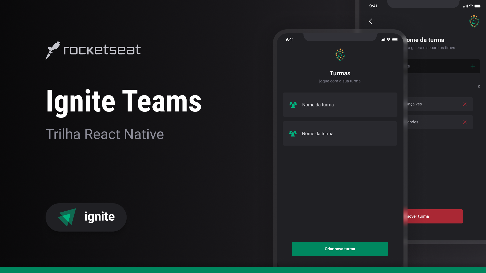

# Ignite Teams

O **Ignite Teams** é um aplicativo desenvolvido em **React Native** que permite a criação e gestão de grupos e times de maneira simples e eficiente. Ideal para situações em que você precisa organizar amigos em diferentes equipes para atividades como jogos ou competições, o aplicativo oferece uma interface amigável e funcional para ajudar na organização.

## Funcionalidades

- **Criar grupos**: Permite a criação de grupos personalizados para diferentes atividades.
- **Excluir grupos**: Os usuários podem excluir grupos desnecessários com facilidade.
- **Adicionar amigos**: Dentro de cada grupo, é possível adicionar amigos e organizá-los em até dois times.
- **Remover amigos**: É possível remover participantes dos grupos conforme necessário.
- **Organização em times**: Divida os participantes do grupo em dois times, facilitando a organização para jogos ou competições.
- **Armazenamento local**: O aplicativo utiliza `AsyncStorage` para salvar grupos e times localmente, permitindo que os dados sejam preservados mesmo ao fechar e reabrir o aplicativo.

## Tecnologias Utilizadas

- **React Native**: Framework para o desenvolvimento de aplicativos mobile multiplataforma.
- **Expo**: Plataforma que facilita o desenvolvimento com React Native.
- **TypeScript**: Linguagem que adiciona tipagem estática ao JavaScript.
- **Tailwind CSS**: Framework de estilização utilizado com [NativeWind](https://www.nativewind.dev/) para a estilização da interface.
- **AsyncStorage**: Para armazenamento local.
- **Lucide**: Ícones personalizados usados no aplicativo.

## ToDo App

